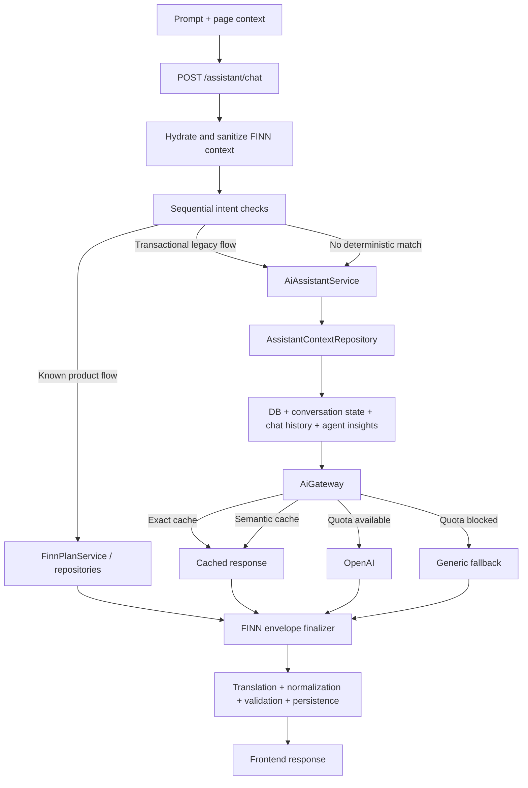
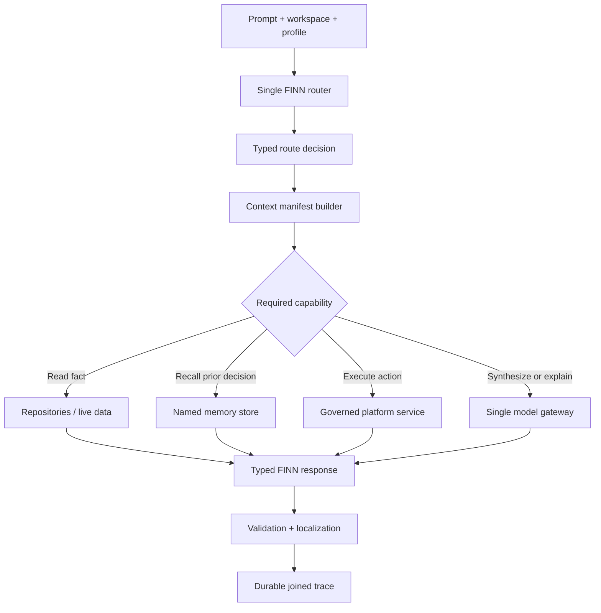

# FINN Runtime Architecture Audit

Date: 2026-07-20  
Scope: production and current `main`  
Change policy: audit only; no runtime behavior changed

## Executive verdict

FINN is currently not one orchestrated assistant. It is a hybrid of:

- a large deterministic request router;
- database-backed workspace services;
- conversation state and chat history;
- scheduled specialist-agent output;
- direct and gateway-mediated OpenAI calls;
- response rescue, translation, normalization and action issuance.

That architecture can produce useful deterministic answers while OpenAI is unavailable, but it is difficult to explain why a specific answer was selected or became incorrect. The production audit also found that the AI execution layer is unhealthy:

- `273,232` AI attempts were logged in the last seven days;
- `273,232` were `quota_blocked` and `258` were `input_unchanged`;
- no successful model call was logged in that period;
- setup and strategy agents caused most attempts;
- two Celery Beat processes are running, although only one appears in the current PM2 app list;
- analysis context can select an insight for the wrong asset.

FINN therefore works today mainly because deterministic/database paths and fallbacks keep it operational, not because the complete assistant architecture is healthy.

## Current runtime chain



Primary implementation paths:

- Entry and router: `backend/trading-tool-backend/backend/api/ai_assistant_api.py`
- Deterministic workspace flows: `backend/trading-tool-backend/backend/services/finn_plan_service.py`
- Legacy synthesis: `backend/trading-tool-backend/backend/services/ai_assistant_service.py`
- Context assembly: `backend/trading-tool-backend/backend/infrastructure/repositories/assistant_context_repository.py`
- Model cache/quota gateway: `backend/trading-tool-backend/backend/services/ai_gateway.py`
- Direct model wrapper: `backend/trading-tool-backend/backend/utils/openai_client.py`
- Localization: `backend/trading-tool-backend/backend/services/locale_service.py`

The streaming endpoint contains a second copy of much of the routing logic. A new flow can consequently work differently in streaming and non-streaming chat.

## Answer-source decision matrix

| Request type | Current primary source | OpenAI expected? | Main risk |
| --- | --- | --- | --- |
| Navigation and direct product actions | Deterministic router and platform service | No | Route duplication and action-contract drift |
| Status, lists, score explanation and most workspace help | `FinnPlanService` and repositories | No | Missing freshness/source metadata |
| Profile capture and explanation | Deterministic parsing plus user preferences | No | Incorrect extraction can silently persist |
| General unmatched question | `AiAssistantService` through `AiGateway` | Yes | Very broad fallback and oversized context |
| Creation/transactional legacy flows | `AiAssistantService` | Usually yes | Trace currently labels some as deterministic |
| Unsupported-language translation | Locale service | Yes | Call is not correlated to the originating FINN trace |
| Daily specialist insights | Celery agents | Yes | Outputs are often global, stale or no longer visibly consumed |
| Setup and strategy scoring | Deterministic calculations plus optional AI explanation | Sometimes | Explanations are attempted far too frequently |

## What "memory" currently means

The code uses the word memory for several unrelated mechanisms:

1. `conversation_state`: active asset and workflow state per user.
2. `ChatSession` and `ChatMessage`: recent conversation history.
3. Behavioral and outcome memory: deterministic events and derived coaching context.
4. AI caches: exact and semantic model-response reuse.
5. Scheduled agent insights: stored summaries later injected as assistant context.

These layers need distinct names and trace fields. A poor answer cannot currently be attributed reliably to chat history, workflow state, behavioral memory, cache reuse or a scheduled insight.

## Specialist-agent inventory

| Agent/task | Current output | Current consumer | Audit status | Recommended role |
| --- | --- | --- | --- | --- |
| Market AI | `ai_category_insights`, usually `GLOBAL` | Legacy insight API/UI and FINN analysis context | Misaligned with asset-first product | Background facts or one global regime summary; no per-user narrative run |
| Macro AI | `ai_category_insights`, usually `GLOBAL` | Legacy insight API/UI and FINN context | Potentially useful but weakly scoped | One global macro snapshot with source and freshness |
| Technical AI | `ai_category_insights`, usually `GLOBAL` | Legacy insight API/UI and FINN context | Wrong model for asset-specific technical analysis | Asset/timeframe calculations first; AI only for requested synthesis |
| Setup agent | Setup scores, daily scores and an AI explanation | Plans, bots and legacy insight UI | Valuable calculation, excessive AI cadence | Keep deterministic scoring frequent; generate narrative only on material change or request |
| Strategy analysis | Strategy snapshots and explanation | Plan/strategy flows | Useful but high attempted volume | Run on strategy change and bounded scheduled review only |
| Master score AI | Master insight and score | FINN, score services and bots | Duplicates deterministic weighted scoring | Calculate score deterministically; use AI only to explain conflicts |
| Daily report | Stored report | Reflectie and FINN report flows | Correct destination, currently quota-blocked | Keep only for active users with new source data |
| Regime memory | Stored regime context | Analysis and coaching context | Useful non-chat specialist | Keep deterministic and expose `as_of`/source |

Specialists should no longer behave as frontend personalities. They should produce versioned domain facts. FINN should be the only assistant that selects, combines and explains those facts.

## Production evidence

### AI usage, last seven days

| Status | Count | Cost |
| --- | ---: | ---: |
| `quota_blocked` | 273,232 | 0 |
| `input_unchanged` | 258 | 0 |

Top entry points:

| Entry point | Attempts |
| --- | ---: |
| `setup_ai_agent:run_setup_agent` | 124,422 |
| `strategy_ai_agent:analyze_strategies` | 117,352 |
| `market_ai_agent:run_market_agent` | 25,557 |
| `score_ai_agent:generate_master_score_for_user` | 2,556 |
| `technical_ai_agent:run_technical_agent` | 1,704 |
| `daily_report_task` | 1,704 |
| `macro_ai_agent:run_macro_agent` | 114 |
| `locale_service:translate_text_if_needed` | 82 |

These are attempts, not successful billable calls. They still create queue load, logs, latency and operational noise.

### Stored insight shape, last seven days

The observed `ai_category_insights` distribution included:

- market: `GLOBAL`;
- macro: `GLOBAL`;
- technical: `GLOBAL`;
- master: mostly `BTC`;
- setup: mostly `BTC`, with a small number of ETH and SOL rows.

This does not match an asset-first workspace where a FINN answer must be demonstrably tied to the active asset and timeframe.

### Scheduler state

Production process inspection found two Celery Beat processes:

- PID `2898889`, started 2026-05-23;
- PID `2985186`, started 2026-07-20.

Only the newer process appears in `pm2 jlist`. Dispatcher wave and per-user leases mitigate duplicate dispatch while Redis is healthy. The dispatcher fails open when broker-state inspection fails, so the orphan scheduler remains a real duplication risk.

## Findings by priority

### P0 - Wrong-asset analysis can enter FINN context

`AssistantContextRepository.build_context_sequential()` queries `AiCategoryInsight` by `user_id` and `category`, but not by active symbol. The same pattern also exists in legacy assistant context building and the legacy agent repository.

Impact: an ETH question can receive the latest BTC or global narrative while the surrounding prompt says ETH.

Required correction: all asset-specific insight reads must require `symbol`, `timeframe`, source and `as_of`. Global macro/regime facts must be explicitly typed as global.

### P0 - Production has no successful AI calls

Every logged model attempt in the audited seven-day window was blocked or skipped. This makes answer-quality debugging misleading: many apparent AI failures are actually deterministic fallback, stale stored content or generic quota fallback.

Required correction: expose model availability in traces and operator telemetry; do not silently present generic model fallback as a normal FINN answer.

### P0 - Background AI workload is unbounded relative to value

Setup runs every 15 minutes for every active user and every configured asset. Strategy analysis is also a dominant call source. Narrative generation should not share the cadence of deterministic scoring.

Required correction: split calculation from explanation and trigger narrative only on material input hash changes, explicit review, or a bounded daily policy.

### P0 - Orphan Celery Beat process

The live host contains two schedulers under one PM2 daemon, while PM2 only reports one managed app.

Required correction: terminate the orphan using the production runbook, verify one Beat PID, then verify Redis leases and queue depth. This is an operational change and should be performed explicitly, not hidden inside an application deploy.

### P1 - FINN trace cannot explain the complete answer

Current prompt audit logging has `trace_id`, selected flow, route source, handler and latency, but lacks a joined context/model manifest.

Missing fields:

- `context_sources` with record IDs;
- `data_freshness` and stale decisions;
- `memory_reads` and memory type;
- `specialists_called`;
- model/cache/quota events and call count;
- token/cost totals;
- fallback chain;
- validation warnings;
- action side effects.

Some creation flows are also labeled deterministic in the source map while their handler invokes `AiAssistantService` and potentially OpenAI.

### P1 - OpenAI access is not centralized

`AiGateway` provides cache and quota behavior, while multiple scheduled agents call the direct OpenAI wrapper. Observability contexts help, but route, fallback and caching policy still differ.

Required correction: one model gateway and one trace propagation contract for chat, translation and background work.

### P1 - Router exists twice

Streaming and non-streaming endpoints contain parallel intent chains.

Required correction: extract one `FinnRouter.route()` that returns a typed decision consumed by both transports.

### P1 - Freshness is absent from the response contract

FINN receives values and summaries without a consistent `as_of`, source or stale reason.

Required correction: every context item needs `source`, `record_id`, `symbol_scope`, `timeframe`, `as_of`, `fresh_until` and `stale`.

### P2 - Cache and fallback semantics can reduce relevance

The main legacy request uses a purpose such as `chat_{intent}` rather than `assistant`; semantic cache can therefore be active where conversational reuse may be unsafe. Quota fallback is a generic macro response regardless of the original question.

Required correction: cache only immutable or explicitly cache-safe flows, and make quota failure explicit and question-specific.

## Target architecture



The model gateway should receive a trace ID and a context manifest, not build hidden context itself. OpenAI should be used for synthesis, explanation and language generation, never to discover facts already available in the platform or to calculate authoritative scores.

## Required FINN trace contract

Every answer should persist one trace record with:

```json
{
  "trace_id": "...",
  "user_id": 0,
  "workspace": "analysis",
  "active_asset": "BTC",
  "timeframe": "1D",
  "locale": "nl",
  "selected_flow": "indicator_explain",
  "router_reason": "...",
  "context_sources": [],
  "data_freshness": [],
  "memory_reads": [],
  "specialists_called": [],
  "model_events": [],
  "response_source": "database",
  "response_handler": "finn_plan_service",
  "fallback_chain": [],
  "validation_warnings": [],
  "actions": [],
  "latency_ms": 0
}
```

Model events must distinguish exact cache, semantic cache, quota block, successful call, parser recovery and translation. One user action should be traceable across API, Celery and model usage logs.

## Execution plan

### Phase 0 - Production containment

1. Remove the orphan Celery Beat process and verify exactly one scheduler.
2. Add an operator alert for more than one Beat PID.
3. Temporarily stop scheduled AI narrative attempts while model quota is unavailable; keep deterministic data collection and scoring active.
4. Change setup AI explanation cadence from every 15 minutes to on-change/on-demand.
5. Verify that queues drain and deterministic scores continue updating.

### Phase 1 - Make every answer explainable

1. Add a durable `finn_response_traces` record or equivalent structured trace sink.
2. Propagate `trace_id` into `AiGateway`, direct wrapper, localization and Celery jobs.
3. Add a context manifest with source IDs, scope and freshness.
4. Correct response-source mapping so traces reflect actual model use.
5. Add an operator trace viewer keyed by trace ID.

### Phase 2 - Correct context and memory

1. Fix all insight queries to enforce asset/timeframe scope.
2. Explicitly separate `GLOBAL` macro/regime facts from asset facts.
3. Rename memory types and define retention/expiry per type.
4. Disable semantic caching for conversational and action flows.
5. Replace generic quota fallback with a transparent source-aware response.

### Phase 3 - One router and one model boundary

1. Extract one typed FINN router for streaming and non-streaming transports.
2. Move all model traffic through one gateway.
3. Make platform actions deterministic and governed.
4. Call OpenAI only after the router proves synthesis is required.
5. Return one stable FINN response contract from every route.

### Phase 4 - Reclassify background agents

1. Keep deterministic collection/calculation jobs.
2. Convert specialist narratives to versioned facts or on-demand explanations.
3. Remove per-user global market/macro/technical generation.
4. Generate reports only for active users with new data.
5. Disable legacy agent tasks only after every current consumer is removed or migrated.

### Phase 5 - Quality evaluation

Build a replayable prompt set covering:

- BTC and ETH;
- day, week, month and quarter;
- NL, EN and DE;
- fresh, stale and missing data;
- wrong-asset contamination tests;
- deterministic answers with zero model calls;
- synthesis with exactly one model call;
- quota-blocked behavior;
- memory present, absent and expired;
- governed actions and failed actions.

For every test, assert selected flow, context sources, freshness, model-call count, response source and validation warnings in addition to response text.

## Acceptance rules

1. Every displayed fact is tied to an asset/global scope, timeframe, source and `as_of`.
2. Missing or stale data is never converted into a synthetic negative score.
3. Navigation, search, asset switching, direct actions and known data questions make zero OpenAI calls.
4. An explicit synthesis/review action makes at most one primary model call; optional translation is separately visible.
5. A FINN trace can explain the complete route and every fallback without reading raw application logs.
6. No periodic AI task runs without a named current consumer.
7. Exactly one Celery Beat scheduler runs in production.

## Recommended immediate decision

Freeze new assistant features. Perform Phase 0 first, then implement the trace contract before changing prompts or agent behavior. Prompt tuning without source-level traceability will mask routing, freshness and scoping defects rather than fix them.

## Phase 0 implementation status

Implemented on 2026-07-20:

- `OPENAI_CALLS_ENABLED=false` provides an explicit deterministic-only production mode.
- Quota failures open a Redis-backed circuit breaker shared by API and Celery processes.
- Repeated block telemetry is deduplicated per entry point and time window.
- Paid calls are bounded per agent/user/asset scope before they reach OpenAI.
- Embedding calls use the same availability and rate-limit boundary.
- Setup scoring remains deterministic and stores a transparent mechanical explanation when AI is unavailable.
- Strategy snapshots store a deterministic fallback for complete plans; incomplete strategies are not fabricated by AI.
- FINN returns a transparent `deterministic_fallback` response instead of presenting a failed model response as AI output.
- Analysis insight lookup now requires the resolved asset before using any explicitly global fallback.
- Celery Beat uses an environment-specific pidfile to prevent a second managed scheduler.

Production still requires the operator actions in Phase 0: set deterministic-only mode, terminate the orphan Beat process, restart managed services and validate counters after deployment.
